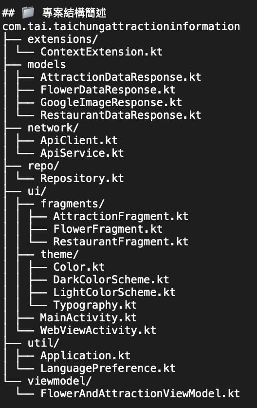

# 🌸 Taichung Attraction Info App

這是一款用於展示台中地區賞花景點與旅遊資訊的 Android App，使用 Jetpack Compose 搭配 MVVM 架構開發，支援多語系切換與地圖定位功能，提供旅遊建議、地點照片、官方網站與 Google Map 連結。

## 🧱 技術架構
- **開發語言**：Kotlin
- **UI 架構**：Jetpack Compose + Jetpack Navigation Component + Fragment
- **架構模式**：MVVM
- **狀態管理**：ViewModel + StateFlow
- **本地儲存**：DataStore（語言設定）
- **資料來源**：
    - 台中市政府 Open Data API（花景、景點及餐廳）
- **定位功能**： Android 原生的 Fused Location Provider API

## ✨ 功能特色
- 📍 串接台中市政府 Open Data API 取得景點、花卉、餐廳資料
- 🌸 賞花及景點資訊詳細介紹
- 🗣️ 多語系切換（中 / 英）
- 🖼️ 賞花及餐廳資訊建置有搜尋功能
- 🔗 點擊官方網站連結在 WebView 顯示與點擊 Google Map 連結跳轉開啟 Google Map App 顯示地點位置
- 🔄 餐廳介紹點擊跳轉開啟 Google Map App 進行導航功能



## 🚀 GitHub
1. **Clone 專案：**
   ```bash
   git clone https://github.com/taiappfactory/TaichungAttractionInformation.git